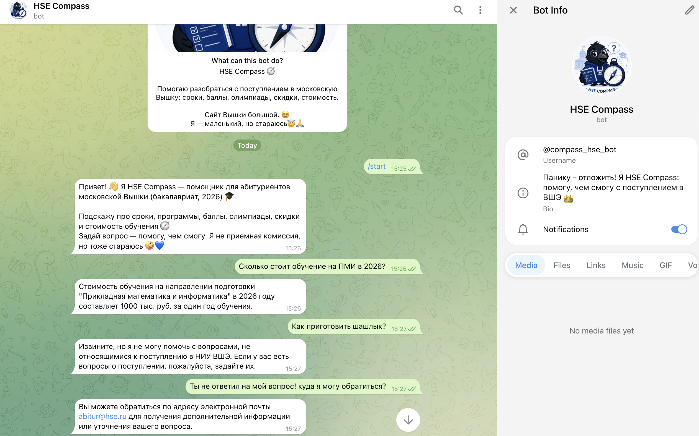

# Чат-бот для абитуриентов НИУ ВШЭ

RAG-чат-бот для абитуриентов НИУ ВШЭ (Москва, бакалавриат, 2026).  
Система отвечает на вопросы о поступлении на основе официальных PDF-документов приемной комиссии: извлекает текст, строит базу знаний в Qdrant, находит релевантные фрагменты и передает их GPT-4o-mini для генерации ответа.

## Документация

- [Дизайн-документ](docs/design_doc.md)

## Технологии

- Qdrant — векторная база данных
- sentence-transformers / E5-base — эмбеддинги
- BGE-reranker-v2-m3 — реранжирование
- GPT-4o-mini / OpenAI API — генерация ответов и переформулировка запросов
- python-telegram-bot — интерфейс Telegram-бота

## Структура репозитория

- `src/` — модули RAG-пайплайна: предобработка, чанкирование, эмбеддер, поиск, реранкер и генератор
- `scripts/` — скрипты запуска экспериментов
- `configs/` — YAML-конфиги экспериментов
- `data/` — корпус PDF-документов, валидационный и тестовый наборы
- `results/` — результаты экспериментов
- `bot.py` — Telegram-бот
- `docs/` — документация
- `report/` — отчет

## Использование

Бот доступен в Telegram: [@compass_hse_bot](https://t.me/compass_hse_bot)

Чтобы начать диалог, отправьте боту команду `/start` и задайте вопрос о поступлении: сроки подачи документов, программы, минимальные баллы, олимпиады, скидки, стоимость обучения.

Для работы боту нужен доступ к OpenAI API; при ограничениях доступа может потребоваться VPN или прокси.

## Пример

## Статус

Учебный прототип для проверки RAG-пайплайна на документах приемной комиссии.  
Проект включает сбор корпуса, индексацию документов, эксперименты с поиском, чанкированием, эмбеддерами и реранжированием, а также Telegram-интерфейс для тестирования.
